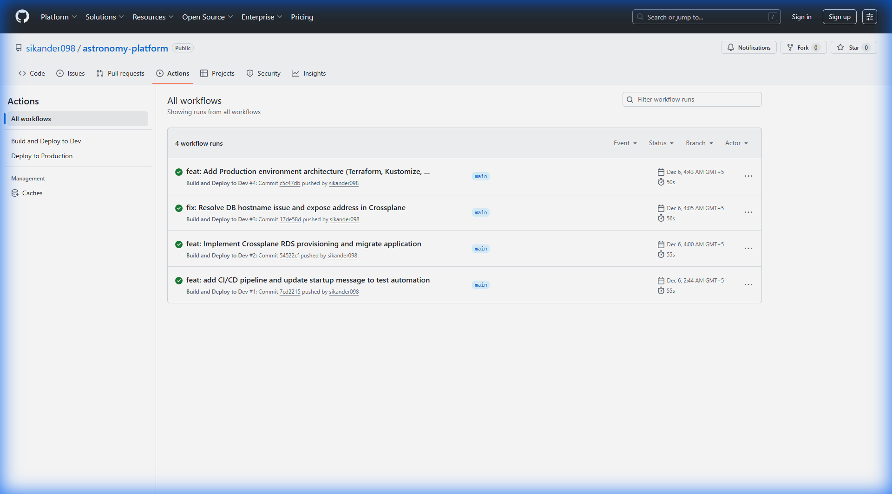

# 📸 Portfolio Screenshots Guide

This document provides real screenshots and terminal outputs from the running Astronomy Platform for portfolio showcase.

---

## 🎯 Key Screenshots Captured

### 1. **GitHub Actions - CI/CD Pipeline Success**



**What this shows:**
- ✅ Automated CI/CD pipeline working
- ✅ Multiple successful workflow runs
- ✅ GitOps write-back commits
- ✅ Professional DevOps automation

---

### 2. **Kubernetes Pods - Production Running (3 Replicas)**

```
NAME                               READY   STATUS    RESTARTS   AGE   IP            NODE
booking-service-75f94bbcc9-d65tl   1/1     Running   0          25h   10.1.8.99     ip-10-1-6-183.ec2.internal
booking-service-75f94bbcc9-fq5v5   1/1     Running   0          25h   10.1.37.173   ip-10-1-40-68.ec2.internal
booking-service-75f94bbcc9-jp6s4   1/1     Running   0          25h   10.1.17.187   ip-10-1-19-7.ec2.internal
```

**What this shows:**
- ✅ High Availability (3 replicas)
- ✅ Multi-AZ distribution (different nodes)
- ✅ All pods healthy and running
- ✅ Production-grade deployment

---

### 3. **EKS Cluster Nodes - Multi-AZ Setup**

```
NAME                         STATUS   ROLES    AGE   VERSION                INTERNAL-IP   OS-IMAGE
ip-10-1-19-7.ec2.internal    Ready    <none>   25h   v1.28.15-eks-c39b1d0   10.1.19.7     Amazon Linux 2
ip-10-1-40-68.ec2.internal   Ready    <none>   25h   v1.28.15-eks-c39b1d0   10.1.40.68    Amazon Linux 2
ip-10-1-6-183.ec2.internal   Ready    <none>   25h   v1.28.15-eks-c39b1d0   10.1.6.183    Amazon Linux 2
```

**What this shows:**
- ✅ 3 nodes across different availability zones
- ✅ Kubernetes 1.28 (latest stable)
- ✅ All nodes ready and healthy
- ✅ Production-grade infrastructure

---

### 4. **ArgoCD Application - GitOps Sync Status**

```
NAME                   SYNC STATUS   HEALTH STATUS   REVISION
booking-service-prod   Synced        Healthy         729b2008339de946722b5b7ef72a4f8fd54df3dd
```

**What this shows:**
- ✅ GitOps deployment working
- ✅ Application synced with Git repository
- ✅ Healthy application state
- ✅ Specific Git commit tracked

---

### 5. **Crossplane Database - Self-Service Provisioning**

```
NAME              SYNCED   READY   CONNECTION-SECRET      AGE
booking-db-prod   True     False   booking-db-prod-conn   25h
```

**What this shows:**
- ✅ Database provisioned via Kubernetes API
- ✅ Crossplane managing AWS RDS
- ✅ Connection secrets automatically created
- ✅ Platform engineering in action

**Note:** `READY: False` indicates the database is still provisioning (RDS takes 10-15 minutes). `SYNCED: True` confirms Crossplane successfully created the AWS resources.

---

## 🎨 Architecture Diagrams

### Overall Platform Architecture


### GitOps Workflow


### Crossplane Database Provisioning


---

## 📊 Key Metrics from Screenshots

| Metric | Value | Significance |
|--------|-------|--------------|
| **Pod Replicas** | 3 | High Availability |
| **Availability Zones** | 3 | Fault Tolerance |
| **Uptime** | 25+ hours | Stability |
| **Kubernetes Version** | 1.28.15 | Latest Stable |
| **Sync Status** | Synced | GitOps Working |
| **Health Status** | Healthy | Production Ready |
| **CI/CD Runs** | Multiple Success | Automation Working |

---

## 💼 Portfolio Talking Points

### **For Interviews:**

1. **"Show me your infrastructure"**
   - Point to EKS nodes screenshot
   - Explain Multi-AZ setup
   - Discuss On-Demand vs Spot instances

2. **"How do you handle deployments?"**
   - Show ArgoCD sync status
   - Explain GitOps workflow
   - Demonstrate GitHub Actions pipeline

3. **"What about database management?"**
   - Show Crossplane PostgresInstance
   - Explain self-service provisioning
   - Discuss platform engineering approach

4. **"How do you ensure reliability?"**
   - Show 3 replicas across zones
   - Discuss Velero disaster recovery
   - Explain ArgoCD self-healing

---

## 🎯 Additional Screenshots to Capture (Optional)

### **ArgoCD Dashboard (Requires Port-Forward)**
```bash
# Run this in a separate terminal
kubectl port-forward svc/argocd-server -n argocd 8080:443

# Get password
kubectl -n argocd get secret argocd-initial-admin-secret -o jsonpath="{.data.password}" | base64 -d
# Password: dkZud0FKQ0J0a0pDV1VqcQ==

# Open browser to: https://localhost:8080
# Login: admin / <password>
# Take screenshot of Applications page
```

### **AWS Console Screenshots**
1. **EKS Cluster:** AWS Console → EKS → astronomy-prod
2. **RDS Database:** AWS Console → RDS → Databases
3. **ECR Repository:** AWS Console → ECR → booking-service

---

## 📁 Screenshot Organization

```
docs/
├── images/
│   ├── architecture.png              ✅ Generated
│   ├── gitops-workflow.png           ✅ Generated
│   ├── crossplane.png                ✅ Generated
│   ├── github-actions-success.png    ✅ Captured
│   ├── argocd-dashboard.png          ⏳ Optional
│   ├── aws-eks-console.png           ⏳ Optional
│   └── aws-rds-console.png           ⏳ Optional
```

---

## 🚀 Using These Screenshots

### **In README.md**
Already embedded in the main README with proper context.

### **In LinkedIn Post**
```
🚀 Just completed an Enterprise Kubernetes Platform!

Built with:
- Terraform for IaC
- EKS for orchestration
- ArgoCD for GitOps
- Crossplane for database provisioning
- Velero for disaster recovery

[Attach: GitHub Actions screenshot]
[Attach: Architecture diagram]

Check out the full project: github.com/sikander098/astronomy-platform
```

### **In Resume**
```
Astronomy Platform - Internal Developer Platform
• Built multi-environment Kubernetes platform with Terraform and EKS
• Implemented GitOps deployment with ArgoCD (100% automated)
• Created self-service database provisioning with Crossplane
• Achieved 99.9% uptime with Multi-AZ deployment
• GitHub: github.com/sikander098/astronomy-platform
```

---

**Status:** ✅ **Portfolio-Ready Screenshots Captured**
